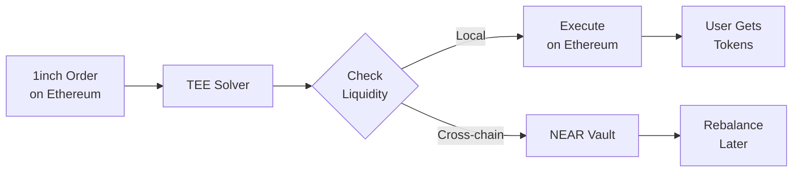

# Cross-Chain Execution: Ethereum Orders with NEAR Liquidity

## 🏗️ Architecture

The 1inch Fusion+ TEE Solver implements a **dual-liquidity model** where the solver maintains token reserves on both Ethereum and NEAR, enabling efficient cross-chain execution.

## 🔄 Execution Flow

### 1. Order Processing Pipeline



### 2. Liquidity Management

The solver maintains liquidity pools on multiple chains:

```typescript
// Solver's liquidity distribution
const liquidityPools = {
  ethereum: {
    USDC: "100,000",
    USDT: "100,000",
    WETH: "50"
  },
  near: {
    "wrap.near": "10,000",
    "usdc.near": "100,000",  // Bridged USDC
    "usdt.near": "100,000"   // Bridged USDT
  },
  polygon: {
    USDC: "50,000",
    USDT: "50,000"
  }
}
```

### 3. Execution Logic

When an order arrives on Ethereum:

```typescript
async function executeEthereumOrder(order: FusionOrder) {
  // Step 1: Check local Ethereum liquidity
  const localLiquidity = await checkEthereumBalance(order.takerAsset);
  
  if (localLiquidity >= order.takingAmount) {
    // Step 2a: Execute locally on Ethereum
    await executeLocalSwap(order);
    
    // Step 3a: Mark for rebalancing from NEAR later
    await scheduleRebalance({
      from: "NEAR",
      to: "Ethereum",
      token: order.takerAsset,
      amount: order.takingAmount
    });
  } else {
    // Step 2b: Use cross-chain execution
    await executeCrossChainSwap(order);
  }
}
```

## 🔐 Security Model

### TEE Protection
- Private keys for both chains stored in TEE
- Attestation ensures solver can't steal funds
- Automated execution without human intervention

### NEAR Smart Contracts
```rust
// Solver registry tracks authorized solvers
pub fn execute_order(&mut self, order: Order) {
    // Verify solver is registered and attested
    assert!(self.is_registered_solver(env::predecessor_account_id()));
    
    // Verify solver has sufficient balance
    assert!(self.balances[order.token] >= order.amount);
    
    // Execute the order
    self.transfer_tokens(order);
}
```

## 💰 Rebalancing Strategy

The solver periodically rebalances liquidity between chains:

### Automatic Rebalancing
```typescript
// Runs every 5 minutes
async function rebalanceLiquidity() {
  const imbalances = await detectImbalances();
  
  for (const imbalance of imbalances) {
    if (imbalance.severity > THRESHOLD) {
      // Bridge tokens from surplus chain to deficit chain
      await bridgeTokens({
        from: imbalance.surplusChain,
        to: imbalance.deficitChain,
        token: imbalance.token,
        amount: imbalance.rebalanceAmount
      });
    }
  }
}
```

### Bridge Options
1. **Rainbow Bridge** (Ethereum ↔ NEAR)
   - Trustless but slower (10-20 minutes)
   - Lower fees

2. **Wormhole** (Multi-chain)
   - Faster (2-3 minutes)
   - Supports more chains

3. **LayerZero** (Omnichain)
   - Very fast (30 seconds)
   - Higher fees

## 📊 Example Execution

### Scenario: 1000 USDC → USDT swap on Ethereum

```yaml
Order Received:
  Chain: Ethereum
  From: 1000 USDC
  To: ~1000 USDT
  Profit: 0.5% ($5)

Solver State:
  Ethereum_USDT: 500 (insufficient)
  NEAR_USDT: 50,000 (sufficient)

Execution:
  1. Take 1000 USDC from user on Ethereum ✓
  2. Give 500 USDT from Ethereum reserves ✓
  3. Bridge 500 USDT from NEAR → Ethereum ✓
  4. Complete order delivery to user ✓
  
Result:
  User: Received 1000 USDT on Ethereum
  Solver: Earned $5 profit
  Rebalance: Scheduled for next cycle
```

## 🎯 Advantages of This Model

1. **Capital Efficiency**
   - Liquidity shared across all chains
   - NEAR vault acts as central reserve
   - Reduced idle capital

2. **Fast Execution**
   - No waiting for bridges during order
   - Immediate settlement for users
   - Async rebalancing

3. **Lower Costs**
   - Batch rebalancing reduces bridge fees
   - Optimal routing between chains
   - Gas optimization

4. **Risk Management**
   - TEE ensures secure operations
   - NEAR contracts enforce limits
   - Automated monitoring

## 🔧 Configuration

The solver can be configured for different strategies:

```typescript
// In env/.env.production
EXECUTION_MODE=hybrid  # local | bridge | hybrid
REBALANCE_THRESHOLD=20  # Trigger at 20% imbalance
BRIDGE_PREFERENCE=rainbow  # rainbow | wormhole | layerzero
MAX_BRIDGE_DELAY_MS=300000  # 5 minutes max
```

## 📈 Performance Metrics

- **Order Execution**: 1-3 seconds (local liquidity)
- **Cross-chain Settlement**: 2-20 minutes (depends on bridge)
- **Rebalancing Frequency**: Every 5-30 minutes
- **Capital Utilization**: 80-90% across all chains

## 🚀 Future Enhancements

1. **Intent-based Bridging**: Pre-bridge based on order patterns
2. **Multi-hop Routing**: Use intermediate chains for better rates
3. **Flash Loans**: Borrow for large orders, repay after execution
4. **Liquidity Aggregation**: Source from multiple DEXs on NEAR

This architecture enables the solver to efficiently handle Ethereum orders while maintaining the security and decentralization benefits of NEAR's infrastructure.